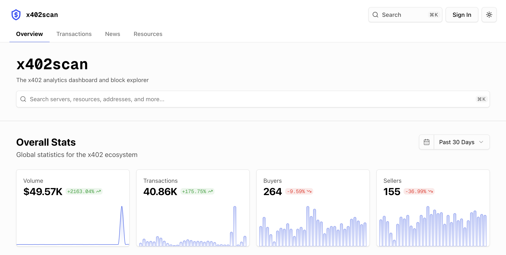

<div align="center">

# x402scan

</div>

<div align="center">
    
  [](https://discord.gg/JuKt7tPnNc) 
   
  [](https://github.com/Merit-Systems/echo) 
  [](https://opensource.org/licenses/Apache-2.0)

</div>

[x402scan](https://x402scan.com) is an ecosystem explorer for [x402](https://www.x402.org/), a new standard for digital payments. It's live at [x402scan.com](https://x402scan.com).




x402 API resources can be be purchased just-in-time without a prior relationship with the seller. x402scan lets you explore the ecosystem of x402 servers, see their transaction volumes, and access their resources.


## Development

*Note: We're working on making this easier to spin-up. If you have any trouble in the mean time, please reach out.*

Fill out a `.env` with the variables in [env.ts](https://github.com/Merit-Systems/x402scan/blob/main/src/env.ts).

Then install and run.
```bash
pnpm install && pnpm dev
```


## Contributing
We're actively seeking contributors to help build x402scan. We believe an ecosystem explorer will shed light on the activities happening over x402, build trust, and help standardize interaction patterns to grow the ecosystem massively.

If you run a facilitator and would like to list your discoverable resources, please reach out via issues.
